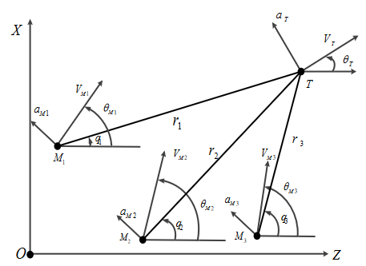
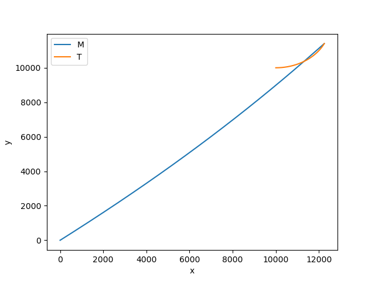

## 模型算法推导

比例导引是一种制导算法，其经典程度相当于控制器中的PID，在本文中，只对其二维平面的情况做分析，考虑一个拦截弹拦截机动目标（固定目标相当于目标速度为0），其运动如下图所示：

$M_i$ 和 $T$ 代表第 $i$ 枚拦截弹和目标；连线 $MT$ 称为拦截弹 $M_i$ 与目标 $T$ 的视线；$r_i$ 为弹目间的相对距离，$r_i$ 关于时间的导数表示为 $\dot r_i$，$q_i$ 为拦截弹 $M_i$ 视线角，其关于时间的导数为 $\dot q_i$  ，$V_M$,$V_T$分别表示拦截弹和目标的速度。 $\theta_i$ 为弹目间速度方向与水平线的夹角，称为速度方向角。拦截弹和目标的前置角分别为$\psi_i = q_i - \theta_i$。

考虑平面内拦截单一机动目标的制导问题，拦截弹与目标的相对运动关系可以用如下微分方程表示

$$
\begin{align}
{\dot{r}}_{i} &= V_{T}\cos\left(q_{i}-\theta_{T}\right)-V_{Mi}\cos\left(q_{i}-\theta_{Mi}\right) \\
r_i {\dot{q}}_{i} &= - V_{T}\sin\left(q_{i}-\theta_{T}\right)-V_{Mi}\sin\left(q_{i}-\theta_{Mi}\right) \\
\end{align}
$$

拦截弹与目标的自身位置机动信息可以用如下微分方程表示

$$
\begin{cases}
\dot x_i = V_{Mi} \cos(\theta_{Mi}) \\
\dot y_i = V_{Mi} \sin(\theta_{Mi}) \\
\dot \theta_{Mi} = \frac{a_{Mi}}{V_{Mi}} \\
\end{cases}

\ \ \ \ \ \ \ \ \ \ 

\begin{cases}
\dot x_i = V_{T} \cos(\theta_{T}) \\
\dot y_i = V_{T} \sin(\theta_{T}) \\
\dot \theta_{T} = \frac{a_{T}}{V_{T}} \\
\end{cases}
$$

比例导引法即使拦截弹速度矢量的旋转角速度与目标线旋转角速度成正比的一种导引方法，这样就可以保证拦截弹拦截到目标，即

$$
a_{Mi} = N  V_{Mi} \dot q_i
$$

其中N为比例导引系数，一般为2-6之间的一个值，选值应该在$1<N<\infty$，比例导引法的弹道特性介于追踪法和平行接近法之间，比例系数越大，弹道越平直，需用法向过载越小。

## python代码

我们这里考虑用python实现，并不是matlab，其一python的结构更加清晰一点，其二后期可能考虑用一些数据驱动的方法用在制导上，用python会更方便。程序的github地址为

程序效果图，其中蓝线为拦截弹，黄线为目标

> main程序是文件的主程序
>
> model程序定义了拦截弹模型，以及中间的视线角距离的计算模型
>
> settings程序定义了一些配置

如果只是使用本程序，只需要考虑修改main程序和settings程序